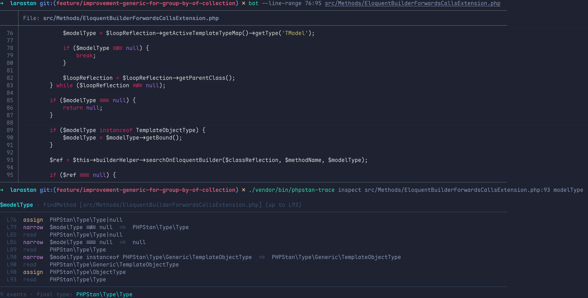

# phpstan-type-trace

> Trace any variable's type history through your code — no more guessing why PHPStan thinks it's `mixed`.



Above: the type evolution of `$modelType` in real larastan code. Nine events — including three `narrow` rows that show *why* the type tightened — one command, zero source edits.

## Install

```bash
composer require --dev kayw-geek/phpstan-type-trace
```

Auto-registered via [phpstan-extension-installer](https://github.com/phpstan/extension-installer). Otherwise add to `phpstan.neon`:

```neon
includes:
    - vendor/kayw-geek/phpstan-type-trace/extension.neon
```

## Two ways to use it

### 1. CLI — inspect any line, no source edits

```bash
./vendor/bin/phpstan-trace inspect src/Foo.php:42 myVar
```

Output:

```
$myVar · doStuff [src/Foo.php] (up to L42)

  L18  param    int|null
  L25  assign   int|null
  L31  narrow   $myVar !== null  =>  int
  L42  read     int

4 events · final type: int
```

Variable name is optional — if only one variable has events at the target line, it's auto-picked. Otherwise the candidates are listed.

Pass `--json` for machine-readable output (handy for tooling).

### 2. `traceType()` — drop in a marker, get the chain on your next phpstan run

No extra command. Just call `traceType($var)` anywhere, then run `vendor/bin/phpstan analyse` like you always do — the chain shows up as a phpstan error at that line.

```php
function compute(?float $discount = null): float
{
    $discount ??= 0.1;
    traceType($discount, 'after ??=');
    return 1 - $discount;
}
```

```
 ------ -----------------------------------------------------------
  Line   PriceCalculator.php
 ------ -----------------------------------------------------------
  5      Type chain for $discount in compute — after ??=
           L3   param      float|null
           L4   assign-op  float
 ------ -----------------------------------------------------------
```

`traceType()` is a runtime no-op (autoloaded from `src/runtime.php`), so leaving a stray call in production code does nothing — it only emits during static analysis.

## Use it with Claude Code

When Claude Code (or any LLM agent) is chasing PHPStan errors, it usually guesses at types. With this extension installed as a [Claude Code plugin](https://docs.claude.com/claude-code), Claude invokes the trace automatically — fixes are grounded in real upstream type evidence, not pattern-matching.

```
/plugin marketplace add kayw-geek/phpstan-type-trace
/plugin install phpstan-type-trace@kayw-geek
```

Installed into `~/.claude/plugins/cache/`, auto-discovered across every project. Updates: `/plugin marketplace update kayw-geek` then reinstall.

## Signature

```php
function traceType(mixed $value, ?string $reason = null): void
```

- `$value` — a variable, property fetch (`$this->x`), or static property (`Foo::$bar`). For arbitrary expressions, only the snapshot type is printed.
- `$reason` — optional label shown in the chain header. String literal only.

## What gets captured

| Source                    | Origin label  | Example                                  |
| ------------------------- | ------------- | ---------------------------------------- |
| Function/method params    | `param`       | `function f(int $x)`                     |
| Closure / arrow-fn params | `param`       | `fn(int $x) => ...`                      |
| Variable assignment       | `assign`      | `$x = 5;`                                |
| Compound assignment       | `assign-op`   | `$x += 1; $x ??= 'def';`                 |
| Reference assignment      | `assign-ref`  | `$x = &$other;`                          |
| Array write               | `array-write` | `$x[] = 'y'; $x['k'] = $v;`              |
| Property fetch            | `read`        | `$this->foo`                             |
| Static property fetch     | `read`        | `Foo::$bar`                              |
| Variable read             | `read`        | bare `$x` usage                          |
| If / ternary narrowing    | `narrow`      | `if (is_string($x))`, `$x ?? 'd'`, etc.  |

`narrow` events carry a `reason` showing the predicate that justified the narrowing (`is_string($x)`, `$x instanceof Foo`, `$x !== null`, ...), anchored to the branch where the narrow takes effect. Same-line events are ordered by source position, so an inline ternary reads cause → effect: the cond-read first, then the narrow, then the then-branch read.

### Extension attribution (`via`)

When a third-party PHPStan extension shaped the type at an event, the responsible extension is appended as `via …`. Three extension categories are attributed today:

| Extension category                       | Event   | Example chain row                                                                                |
| ---------------------------------------- | ------- | ------------------------------------------------------------------------------------------------ |
| Dynamic return type (method / static / function) | `assign` / `assign-op` | `L9   assign  Builder<User>  via NewModelQueryDynamicMethodReturnTypeExtension`                  |
| Type-specifying (method / static / function), inside an `if` / ternary condition | `narrow` | `L12  narrow  Webmozart\Assert\Assert::notNull($x)  =>  string  via AssertTypeSpecifyingExtension` |
| Properties class reflection (magic / virtual attrs) | `read`  | `L23  read    string  via MagicPropsExt`                                                          |

Third-party detection is by source-file location, not namespace — official add-ons (e.g. `phpstan/phpstan-webmozart-assert`) that ship under the `PHPStan\` namespace are still attributed; only classes shipped by `phpstan/phpstan` core (or its phar) are filtered out.

When the inferred type surprises you, `via` tells you which extension to blame (or thank) without grepping the vendor tree.

Real CLI output against a project with `phpstan/phpstan-webmozart-assert` installed:

```
$ ./vendor/bin/phpstan-trace inspect src/demo.php:12 '$x'

$x · Demo\viaIfStatic [src/demo.php] (up to L12)
────────────────────────────────────────────────────────────────────────────────
  L9   param   string|null
  L12  narrow  Webmozart\Assert\Assert::notNull($x)  =>  string  via AssertTypeSpecifyingExtension
  L12  read    string
────────────────────────────────────────────────────────────────────────────────
3 events · final type: string
```

**Not attributed yet:** type-specifying calls used as bare statements (e.g. `Assert::notNull($x);` outside any `if` / ternary). PHPStan still narrows the scope but no `narrow` event is emitted, so the chain shows `read` without an explanation. Wrap the call in an `if` if you need the attribution.

## Limitations

- Loops report the post-fixpoint type, not per-iteration deltas.
- Multiple closures inside the same enclosing function share one bucket. Same-named vars across sibling closures may collide.
- Cannot follow values across function boundaries.
- Ref-aliases (`$alias = &$x; $alias[] = 'y';`) show only the snapshot at the call.

<details>
<summary><strong>How it works</strong></summary>

Two-phase PHPStan pipeline:

1. **Collectors** (one per event kind) record every relevant AST event with `(file, functionKey, path, line, pos, type, origin)`:
   - Param entry: `ParamInFunctionCollector`, `ParamInMethodCollector`, `ParamInClosureCollector`, `ParamInArrowFunctionCollector` — hooked on PHPStan's `In*Node` virtual nodes so scope is already inside the function when params are read.
   - Reads: `VarReadCollector`, `PropertyFetchCollector`, `StaticPropertyFetchCollector`.
   - Writes: `AssignCollector`, `AssignOpCollector` (covers all 13 compound-op subclasses), `AssignRefCollector`, `ArrayWriteCollector`.
   - Narrowing: `NarrowingCollector` (if-statements), `TernaryNarrowingCollector` (ternaries) — anchored to the branch where the narrow holds, with a reason predicate extracted from the guard.
   - Call sites: `TraceCallCollector`.
2. **`TraceReportRule`** runs once at the end on the virtual `CollectedDataNode`. For each `traceType()` call it joins the recorded events on `(functionKey, path)` filtered to lines `<=` the call line, sorts by `line → source position → rank` (so inline ternaries read cond-read → narrow → then-read, not narrow first), collapses repeated reads of the same type *except* right after a narrow (since the narrow is evidence and the read is the usage — they convey different things), and emits the delta chain as a PHPStan error.

The CLI runs the same pipeline with a dump env var set, captures every chain as a JSON sentinel error, then filters to the `(file, line, variable)` you asked about.

</details>

## License

MIT
